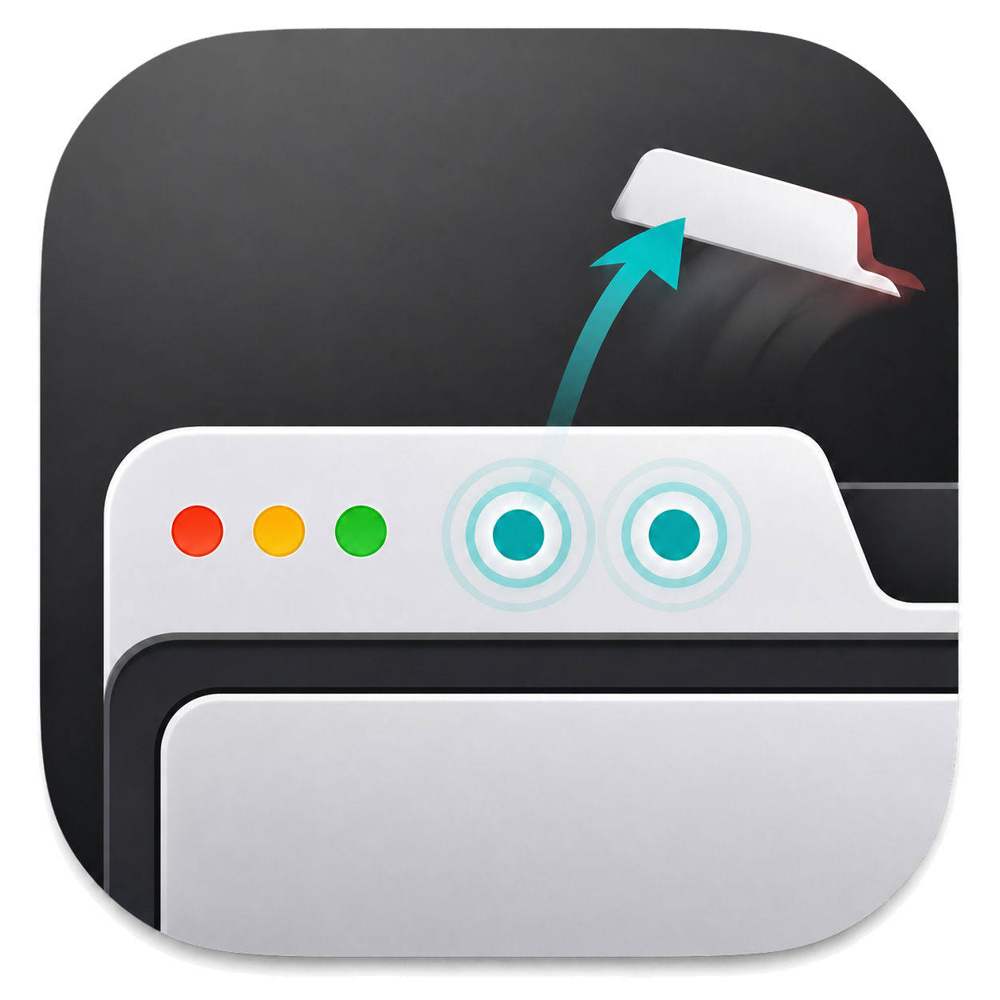

# TabTap

<p align="center">
  
</p>

TabTap 是一个轻量的 macOS 菜单栏工具。只用触控板或鼠标浏览网页时，直接
双击 Google Chrome 原生标签页即可关闭：不需要使用键盘快捷键，也不需要把
指针准确移到狭小的关闭按钮上。

TabTap 不会向 Chrome 注入代码、修改浏览器或读取网页内容。

## 下载与安装

1. 从 [Releases](https://github.com/ALEXsun0/TabTap/releases/latest) 下载最新的
   `TabTap-<版本>-macOS-arm64.dmg`。
2. 打开 DMG，将 TabTap 拖入“应用程序”文件夹。
3. 从“应用程序”文件夹启动 TabTap。

当前版本适用于 Apple Silicon Mac，需要 macOS 13 或更高版本以及 Google
Chrome。

### macOS 阻止首次打开

当前 GitHub 发布版使用 ad-hoc 签名，尚未经过 Apple 公证。首次打开时，macOS
可能显示无法验证开发者：

1. 先尝试按住 Control 键点击 TabTap，选择“打开”。
2. 如果仍被阻止，前往“系统设置 → 隐私与安全性”。
3. 在安全提示旁点击“仍要打开”，然后再次确认。

建议只从本仓库的 Releases 页面下载安装包。

## 首次授权

TabTap 需要“辅助功能”和“输入监控”权限才能识别并关闭 Chrome 原生标签页。
首次启动后，按照窗口中的顺序完成：

1. 点击打开“辅助功能”设置，允许 TabTap。
2. 返回 TabTap，再点击打开“输入监控”设置并允许 TabTap。
3. 输入监控授权完成后，点击“重新启动 TabTap”。

TabTap 只会在用户点击对应按钮后打开系统设置或请求权限。授权成功并开始监听
后，后台权限轮询会自动停止；打开菜单或“权限与状态”窗口时会即时复检。

ad-hoc 签名没有稳定的开发者身份。部分 macOS 版本可能不会自动把 TabTap
加入权限列表，此时请点击列表下方的“+”，选择：

```text
/Applications/TabTap.app
```

当前发布版没有稳定的 Developer ID 签名证书。每次更新后，macOS 的 TCC 权限
系统可能把新构建识别为另一个应用，因此需要重新授予“辅助功能”和“输入监控”
权限：请在两个权限列表中移除旧的 TabTap，重新添加新版本并重启应用。

## 使用方式

1. 确认菜单栏中的 TabTap 状态为“监听状态：运行中”。
2. 将 Google Chrome 切换到前台。
3. 在标签页标题区域连续双击，即可关闭该标签页。

点击网页内容、工具栏空白处或标签页关闭按钮不会触发 TabTap。关闭权限窗口也
不会退出应用，TabTap 会继续在菜单栏运行。

## 菜单栏功能

- **启用**：临时开启或关闭双击监听。
- **监听状态**：显示当前是否正在运行或缺少权限。
- **权限与状态**：重新检查权限并打开授权向导。
- **打开“辅助功能”设置**：直接进入对应系统设置。
- **打开“输入监控”设置**：直接进入对应系统设置。
- **登录时启动**：控制 TabTap 是否随登录启动。
- **退出 TabTap**：停止监听并退出应用。

## 常见问题

### 双击标签页没有反应

确认菜单栏显示“监听状态：运行中”，Chrome 位于前台，并且双击的是原生标签页
标题区域。如果刚更新过应用，请重新授予辅助功能和输入监控权限。

### 权限已经打开，但仍显示待授权

先确认权限列表中的路径是 `/Applications/TabTap.app`，然后完全退出并重新启动
TabTap。输入监控状态有时只有在应用重启后才会刷新。

### 为什么每次更新后都要重新授权

这是当前发布版缺少稳定 Developer ID 签名证书造成的。macOS 会根据代码签名
身份管理辅助功能和输入监控权限；ad-hoc 签名在重新构建后身份可能变化，系统
因而不会自动把旧版本的授权继承给新版本。安装更新后，请移除权限列表中的旧
记录，重新添加 `/Applications/TabTap.app`，然后重启 TabTap。

### 是否支持其他浏览器

当前版本只处理 Google Chrome 原生标签页，不支持 Firefox、Safari、Edge 或
网页内部标签。

## 隐私

TabTap 不包含网络请求、遥测、分析或自动更新服务。鼠标事件只在本机用于判断
是否双击了 Chrome 原生标签页，处理后立即丢弃。

## 从源码构建

需要 Xcode 及其命令行工具：

```sh
git clone https://github.com/ALEXsun0/TabTap.git
cd TabTap
swift test
./script/package_dmg.sh
```

应用和安装镜像会生成在 `dist/`。默认构建使用 ad-hoc 签名，适合自行安装和
测试。

如钥匙串中已有可用的代码签名证书，可以指定自己的签名身份：

```sh
CODE_SIGN_IDENTITY="Developer ID Application: Your Name (TEAMID)" \
  ./script/package_dmg.sh
```

## 许可证

[MIT](LICENSE)
